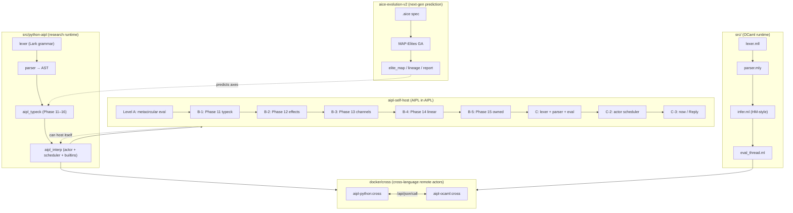

# AIPL — Actor-based Intelligent Parallel Language

A research vehicle that combines:

1. **A multi-runtime actor language** (OCaml + Python + Browser-JS).
2. **A genetic-algorithm-based "next-gen language predictor"**
   (`aice-evolution-v2`) that empirically derives universal
   directions for language design.
3. **A self-reflective bootstrap of itself** (`aipl-self-host`)
   that makes AIPL parse, type-check, evaluate, and schedule its
   own programs.

This document is the bird's-eye index — the entry point that names
every artifact and explains how they connect.

---

## Architecture (Mermaid)



---

## Phases implemented in the runtime (Python AIPL)

| phase | feature                               | source / sample                        |
| ---   | ---                                   | ---                                    |
| 11a–e | typed annotations / unions / generics / length-arrays | `samples/Typecheck*.abcl` |
| 12    | capability effects `!{fs,ai,net,mut}` | `samples/Effects.abcl`                 |
| 13    | CSP channels                          | `samples/Channels.abcl`                |
| 14    | linear / use-after-move               | `samples/Linear.abcl`                  |
| 15    | owned (`pub` field visibility)        | `samples/Owned.abcl`                   |
| 16    | transient cast at any-boundary        | `samples/Transient.abcl`               |
| 17    | structured concurrency (`scope { future ... }`) | `samples/Phase17_StructuredConc.abcl` |

Each phase has a `_test_*.py` unit test under `src/python-aipl/`.

---

## Self-host (`aipl-self-host/`)

| Level | what AIPL itself does                 | smoke |
| ---   | ---                                   | ---   |
| A     | `eval(ast, env)` — metacircular       | 4/4   |
| B-1   | Phase 11 type checker                 | 6/6   |
| B-2   | Phase 12 capability-effects checker   | 4/4   |
| B-3   | Phase 13 channel element-type checker | 5/5   |
| B-4   | Phase 14 linear / use-after-move      | 4/4   |
| B-5   | Phase 15 owned (pub visibility)       | 4/4   |
| C     | lexer + parser + eval pipeline        | 3/3   |
| C-2   | actor scheduler + mailbox             | 6/6   |
| C-3   | + `now` / `Reply` synchronous reply   | 1/1   |

**Total: 37/37 smoke tests passing across the self-host stack.**

Every Level B-N's checker also passes its own rules when applied
to itself (the `SampleSelfConsistency.abcl` fixture), proving phase
monotonicity.

---

## aice-evolution-v2 — next-gen language prediction

The MAP-Elites GA in `aice-evolution-v2/` takes an `.aice` spec and
empirically derives universal axes via cross-task evaluation under
LLM-directed mutation operators.  Major specs:

| .aice                                       | what it predicts                          |
| ---                                         | ---                                       |
| `NextLanguagePrediction.aice`               | Phase 9 baseline (5 universal axes)       |
| `AIPLSelfHost_A_Metacircular.aice` etc.     | self-host design space per Level          |
| `AIPLPostC2_NextGen.aice`                   | Phase 17 candidate from current state     |
| `AIPLPhase17_Structured.aice`               | Phase 17 structured-concurrency refinement |

### Phase 9 (delivered)

The original prediction (5 axes, all now implemented):

```
type_safety          = high / dependent     ← Phase 11
effect_handling      = capability           ← Phase 12
concurrency_model    = csp_channels         ← Phase 13
ownership_model      = linear               ← Phase 14
state_representation = symbol_owned         ← Phase 15
```

### Phase 17 prediction (delivered)

Re-run with AIPL post-Level-C-2 as the seed:

```
trend top 3:
  concurrency_model       +0.50    ← strongest (= structured)
  type_safety             +0.25
  ownership_model         +0.25
```

Top elite at the refinement step pins
`concurrency_model = structured + ownership_model = linear +
type_safety = dependent` — exactly the design we implemented in
Phase 17 (`scope { future ... }` with linear future handles).

Visualisations live under `aice-evolution-v2/viz/`:
- `index.html` summary + lineage tables
- `level_{A,B1,B2,C}.html` Chart.js dashboards
- `level_{A,B1,B2,C}_tree.html` SVG lineage trees
- `postC2.html` / `phase17.html` — the post-C2 + refinement runs

---

## Soundness boundary

The accompanying paper `docs/AIPL_Type_Soundness_Report.{tex,pdf}`
walks through exactly which parts of AIPL's gradual type system
are sound and which boundaries gracefully degrade to runtime
checks.  Phase 16 closed the highest-priority unsoundness gap by
inserting transient casts at every `any → T` boundary; the report
documents the residual gaps and their priorities for future work.

---

## Cross-language remote actors

`docker/cross/` ships two Docker images (`aipl-python:cross` and
`aipl-ocaml:cross`), a `docker-compose.yml`, and a fallback
`docker run`-based driver script.  Both images speak the same
HTTP wire format (`POST /api/json/call`), so a Python actor can
invoke an OCaml actor and vice versa.  See
`docker/cross/README.md` for run instructions.

---

## Reading order

If you're new to the project, this is the recommended path:

1. `USER_MANUAL.md` — language reference, top-down by Phase.
2. `docs/AIPL_Type_Soundness_Report.pdf` — what the type system
   does and doesn't prove.
3. `aipl-self-host/level-a/README.md` then `level-b{1,2,3,4,5}` —
   how AIPL implements its own type system in pure AIPL.
4. `aipl-self-host/level-c{,2,3}/README.md` — the parser and
   scheduler self-host steps.
5. `aice-evolution-v2/README.md` then
   `docs/AIPL_Phase17_Prediction.md` — how the next-gen-axis
   predictor works and what it currently recommends.
6. `docker/cross/README.md` — cross-language interop demo.

---

## All-samples index

### Python AIPL (`src/python-aipl/samples/`)

```
Phase  feature              sample
11+    typed Counter         Counter.abcl
       typed Hello           Hello.abcl
       typed PingPong        PingPong.abcl
       typed NowFuture       NowFuture.abcl
       typed records         Records.abcl
       typed tuples          Tuples.abcl
       typed arrays          Arrays.abcl  MultiDimArrays.abcl
       generics + signatures Functions.abcl  Signatures.abcl
       method patching       MethodPatch.abcl
       dynamic compile       Dynamic.abcl  DynamicWorkerPool.abcl
12     capability effects    Effects.abcl
13     CSP channels          Channels.abcl  Channels2.abcl
14     linear                Linear.abcl  Linear2.abcl
15     owned                 Owned.abcl  Owned_violations.abcl
16     transient cast        Transient.abcl  Transient_violation.abcl
17     structured conc.      Phase17_StructuredConc.abcl
ai     real LLM samples      samples-ai/*.abcl
remote remote-actor demos    samples-remote/*.abcl
```

### OCaml AIPL (`abclc/`)

```
Phase11_TypedCounter.abcl
Phase12_EffectsLog.abcl
Phase13_Channels.abcl
Phase14_Linear.abcl
Phase15_Owned.abcl
... plus the existing Hello/Counter/PingPong/Philosophers etc.
```

### Self-host (`aipl-self-host/`)

```
level-a/    SampleHelloMin / SampleArith / SampleControl / SampleFib
level-b1/   SampleClean / SampleArityViolation / SampleTypeViolation /
            SampleReturnViolation / SampleUnion / SampleSelfConsistency
level-b2/   SampleEffectClean / SampleEffectMissing / SampleEffectIndirect /
            SampleSelfConsistency
level-b3/   SampleChannelClean / SampleChannelSendMismatch /
            SampleChannelRecvMismatch / SampleChannelTryRecv /
            SampleSelfConsistency
level-b4/   SampleLinearClean / SampleUseAfterMove /
            SampleDoubleConsume / SampleSelfConsistency
level-b5/   SampleOwnedClean / SamplePrivateRead /
            SampleExternalWrite / SampleSelfConsistency
level-c/    SampleLexer / SamplePipeline / SampleWhile
level-c2/   SampleCounter / SamplePingPong / SampleSelfSend /
            SampleMethodArgs / SampleProducerConsumer / SampleWorkerPool
level-c3/   SampleNow
```

### Cross-language (`docker/cross/`)

```
samples/python_server.abcl  Python Counter on :8080
samples/python_driver.abcl  Python driver → Py + OCaml
samples/ocaml_server.abcl   OCaml Calc on :8080
samples/ocaml_driver.abcl   OCaml driver → OCaml + Py
```

---

## Repository layout

```
abclcp-project/
├── AIPL_OVERVIEW.md            ← this file
├── USER_MANUAL.md              language reference
├── README.md                   build instructions (legacy)
├── Makefile                    OCaml + JS build targets
├── docs/
│   ├── AIPL_Type_Soundness_Report.{tex,pdf}
│   ├── AIPL_Phase17_Prediction.md
│   └── ...
├── src/
│   ├── *.ml / *.mll / *.mly    OCaml runtime
│   ├── python-aipl/            research runtime
│   └── browser-abcl/           browser-side runtime
├── abclc/                      OCaml-side .abcl samples
├── aice-evolution-v2/          next-gen-axis predictor
│   ├── examples/*.aice         GA specs
│   ├── src/                    GA implementation
│   └── viz/                    HTML visualisations
├── aipl-self-host/             AIPL in AIPL (Levels A → C-3)
├── docker/cross/               cross-language Docker demo
└── ...
```
